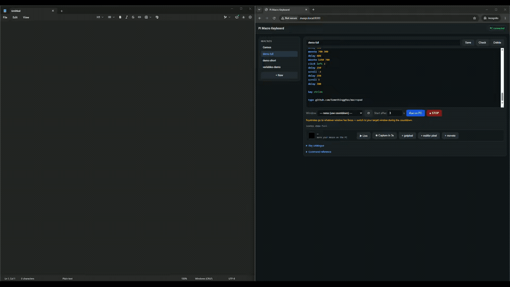

# macropad

Turn a Raspberry Pi 4 into a **real USB keyboard and mouse** for another computer,
scriptable from a web IDE.

The Pi plugs into a PC over USB-C and enumerates as genuine HID hardware — not
synthetic input. It works on a login screen, in a BIOS, in a remote desktop
session, and on machines where you cannot install anything.



*The whole demo above is one macro, running in real time. The editor on the
right highlights each line as it executes. ([full-quality MP4](demo.mp4))*


---

## What it does

- **Types and clicks as real hardware.** A composite USB gadget: HID keyboard on
  `/dev/hidg0`, HID mouse on `/dev/hidg1`.
- **A macro language** with delays, random ranges, loops, labels, jumps,
  variables, arithmetic, conditionals and probability.
- **A web IDE** served from the Pi: syntax highlighting, autocomplete, a key
  catalogue, live line highlighting while a macro runs, and an emergency stop.
- **An optional PC agent** that adds window focus, clipboard, screen geometry and
  pixel reading — the things a keyboard fundamentally cannot see by itself.

## Hardware

- Raspberry Pi 4 Model B (its USB-C port supports device mode)
- A **USB-C data cable** to the PC — see the gotchas, this trips everyone up
- A 5V power source on the GPIO pins, because the USB-C port is busy being a
  device. A phone charger of 2A or more works; a PC USB port does not.

## Install

```bash
git clone https://github.com/SomethingMax2/macropad.git ~/macropad
cd ~/macropad

# 1. enable the USB device-mode driver
echo 'dtoverlay=dwc2,dr_mode=peripheral' | sudo tee -a /boot/config.txt
sudo sed -i 's/rootwait/rootwait modules-load=dwc2/' /boot/cmdline.txt

# 2. install the gadget, services and permissions
sudo install -m 755 usb-hid-gadget.sh /usr/bin/usb-hid-gadget.sh
sudo install -m 644 systemd/*.service /etc/systemd/system/
sudo install -m 644 udev/99-hidg.rules /etc/udev/rules.d/
sudo groupadd -f hidgadget && sudo usermod -aG hidgadget "$USER"
sudo systemctl daemon-reload
sudo systemctl enable --now usb-gadget.service macropad-web.service

sudo reboot
```

Then open `http://<pi-hostname>.local:8080` from the PC.

Check it worked:

```bash
cat /sys/class/udc/*/state     # -> configured
ls -l /dev/hidg0 /dev/hidg1
```

## The macro language

```
# a comment (only at the start of a line)

type hello world              # send keystrokes
key ctrl+alt+delete           # a combo; also f1-f24, arrows, keypad
hold shift                    # key down, stays down
release shift                 # key up; bare 'release' drops everything
delay 250                     # milliseconds
delay 100-400                 # random within a range

set name Max                  # variables
set n 3
add n 1                       # arithmetic; negative subtracts
type hello $name              # $$ is a literal $

repeat $n                     # loops
  type tick
end

label top                     # labels and jumps
jumpif n < 5 top              # < <= > >= == != contains

limit none                    # run until STOP; default cap is 300s
chance 30 type maybe          # runs 30% of the time
oneof alpha|beta|gamma        # picks one at random

moveto 1280 720               # mouse, absolute
move 40 -10                   # relative
click left 2
scroll -3
mousedown left / mouseup      # drag

focus Chrome                  # needs the agent
focus class:UnityWndClass     # or exe:, title:, a window id, or #2 for the
                              # second match. Ties go to the largest window
anchor class:UnityWndClass    # make x/y relative to that window's client area
waitfor window Chrome 5000
paste anything — even 🎉 or 中文
clip var                      # read the PC clipboard
getpixel 800 400 col
waitfor pixel 800 400 near #ff0000 10000   # 'near' tolerates a shade or two
```

Runaway loops are capped by step and time limits, and every macro releases all
held keys and buttons when it ends, errors, or is stopped.

## The PC agent (optional)

A keyboard cannot see the screen. The agent is a single stdlib-only Python file
that answers the questions the Pi cannot:

```
python agent/windows-agent.py
```

It provides window listing and focus, the clipboard, pixel colours, cursor
position, and the virtual desktop geometry. Allow it through the Windows
firewall on **private networks** or the Pi cannot reach it.

The Pi discovers the PC's address from the browser connecting to the IDE, so
there is nothing to configure.

Without the agent everything except `focus`, `paste`, `clip`, `getpixel` and
`waitfor` still works.

## Gotchas worth knowing

These each cost hours to find.

**A charge-only USB-C cable looks identical to a data one.** It will power the
Pi and enumerate nothing. If `/sys/class/udc/*/state` says `not attached`, try a
cable you have actually moved files with.

**Layout is the host's business, not the Pi's.** HID sends physical key
positions; the PC decides what character that is. On US-International, `"` `'`
`` ` `` `~` `^` are dead keys — sending `"` then `a` yields `ä`, and a dead key
plus space yields the bare character. `layouts.py` handles this. Anything the
layout cannot reach is rejected before a single key is sent. Use `paste` for
arbitrary text.

**Windows caches USB descriptors per VID/PID/revision.** Change the gadget's
composition without bumping `bcdDevice` and Windows keeps using the stale
descriptor — the new interface silently never works.

**Writes to `/dev/hidg*` block until the host polls that endpoint.** With no
timeout, one write hangs forever and takes the process with it. Writes here are
non-blocking with a deadline.

**Pointer acceleration makes relative mouse deltas unusable for precision.**
Long fast moves overshoot, and corrections oscillate. With the agent, absolute
moves are placed by the OS; without it, the pointer slams into a screen corner
to establish an origin and steps out from there.

**The virtual desktop's corner may not exist.** With mismatched or offset
monitors the bounding box has dead space no monitor covers, so the pointer stops
somewhere else entirely. The agent reports where it actually landed.

**An elevated app cannot be focused by a normal-privilege agent.** Windows
blocks it outright, so `focus` fails on anything running as administrator. Run
the agent as administrator too - or skip the API entirely and click the window
with the HID mouse, which is real hardware input and always allowed.

**Under-volting corrupts SD cards.** A PC USB port cannot run a Pi 4. Check
`vcgencmd get_throttled` — anything but `0x0` means fix your power first.

## Security

This is a device that types into your computer. The web IDE has **no
authentication** and binds to all interfaces — it is built for a trusted home
network. Do not expose it to the internet.

## License

MIT
